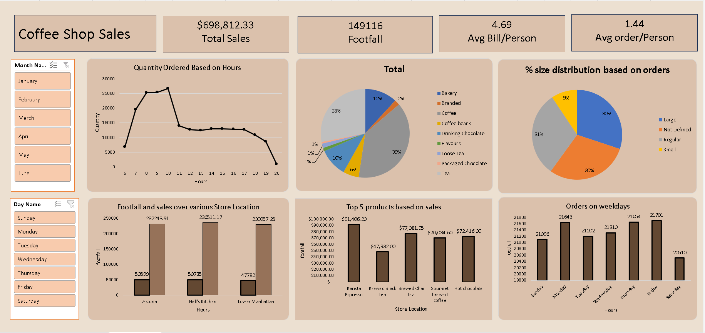

# Coffee-Shop-Sales
Excel-based data analysis project focusing on coffee shop sales trends, customer behavior, and interactive dashboard creation.
# ☕ Coffee Shop Sales Analysis

## 📌 Project Overview
This project focuses on analyzing coffee shop sales data to uncover key business insights such as sales trends, customer preferences, and product performance.

## 📊 Dashboard Preview

## 🔍 Key Insights
- Identified peak sales hours and high-demand products  
- Analyzed category-wise revenue contribution  
- Observed trends in daily and hourly sales  

## 🛠️ Tools Used
- Microsoft Excel (Pivot Tables, Charts, Dashboard)

## 📂 Dataset
The dataset used in this project is included in this repository.
